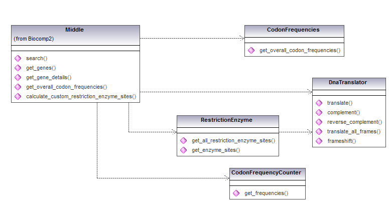

# Middle layer documentation
author: Jurn Ho <jurn@magicmonster.com>

## module overview
This module is used by the front end CGI scripts,
and depends on the datalayer. It has been split into a few smaller
 modules that are not used directly.
Precalculated codon frequencies are stored in a CSV file,
as are the default set of enzymes that can cut DNA sequences.

## Middle module usage

### search
Accepts a single search string as a parameter.
A substring search is performed on against all genes. Any gene with a gene product, id, locus, or accession version
that matches will be returned.
A hash of hashes is returned.
The top level hash has gene_id for the key,
The second level hash has properties of the gene, keyed by 'accession_version', 'name', 'locus', 'product',
and 'protein_id'
### get_genes
Accepts no parameters.
A hash of hashes is returned.
The top level hash has gene_id for the key,
The second level hash has properties of the gene, keyed by 'accession_version', 'name', 'locus', 'product',
and 'protein_id'
### get_gene_details
Accepts a single gene id string as a parameter.
Output: a hash with a lot of info about the gene.
Valid keys are

|key|description|
|---|-----------|
|id|contains the gene id|
|accession_version|the accession version|
|name|gene name|
|locus|gene locus, e.g."16p13.3"|
|product|the gene product, e.g. a chemical name|
|protein_id|protein id|
|dna_sequence|DNA sequence, a long string that can be several thousand bases.|
|exons| A reference to an array of hashes. Each hash is described as exon and is described below.|
|coding_sequence|This is based on the exons and is a subset of the DNA sequence|
|aa_sequence|a string for the translated coding sequence. These are amino acids or residues|
|codon_frequencies|contains a reference to a hash of codons to count|
|restriction_sites|contains a reference to a hash of enzyme to positions on the DNA sequence where the enzyme cuts. Exon positions should be considered to determine whether before or after the coding region.|

 Exon hash

|key|description|
|---|-----------|
|number|the exon number. This starts from 1|
|start|the start position in the DNA sequence|
|end|the end position in the DNA sequence|

### get_overall_codon_frequencies
returns a hash of codon to counts for all of genes in chromosome 16
### calculate_custom_restriction_enzyme_sites
input: this takes two inputs

1.  gene_id
2.  enzyme cutting pattern. It should be a string contain bases, and also a caret '^' within the string.  e.g. "G^GATCC"

Returns an array of positions where this enzyme will cut.

## example usage
See `dump_genes.pl` for sample code usage
